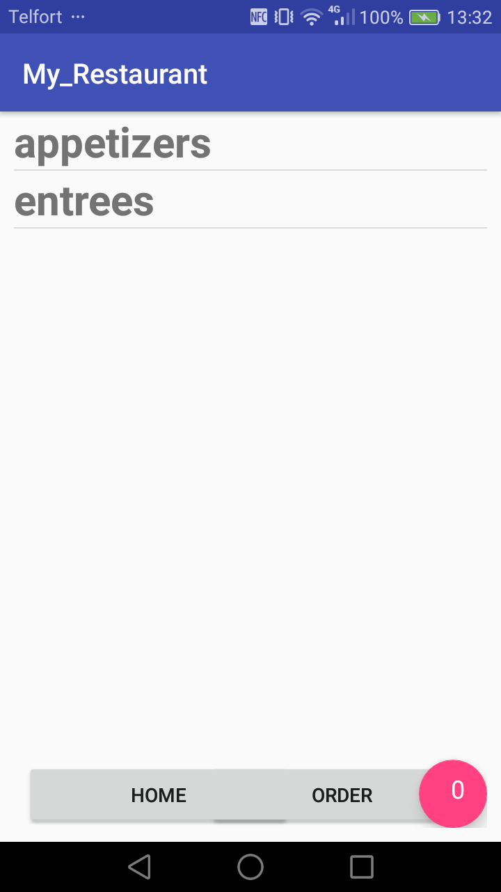
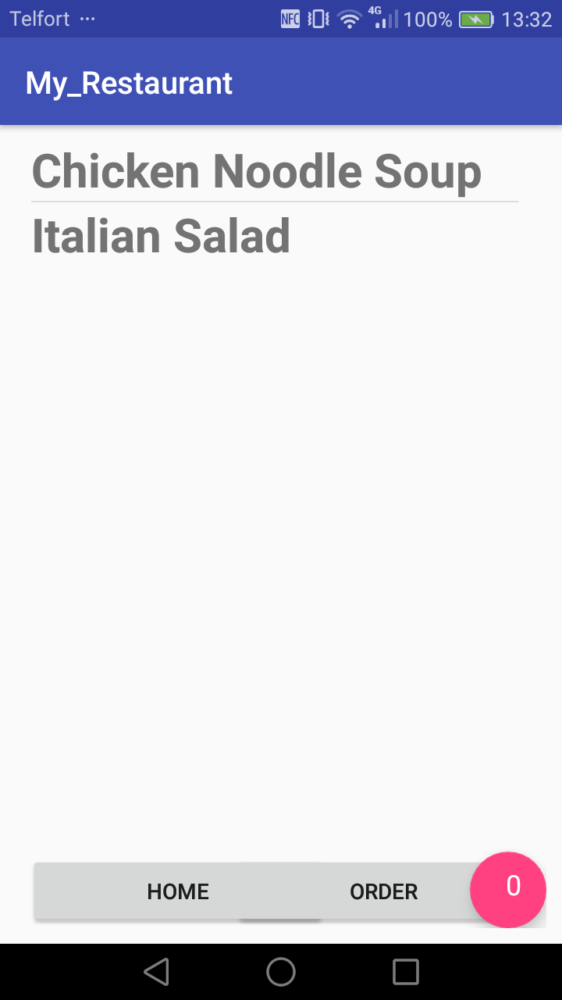
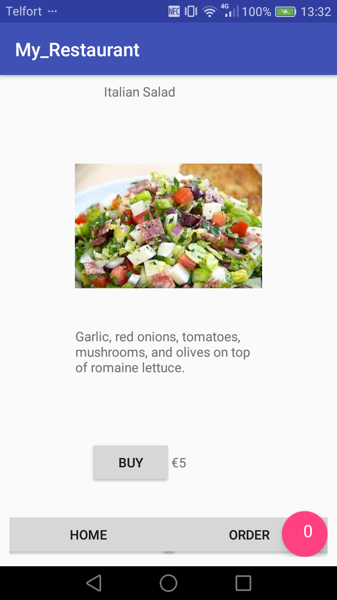
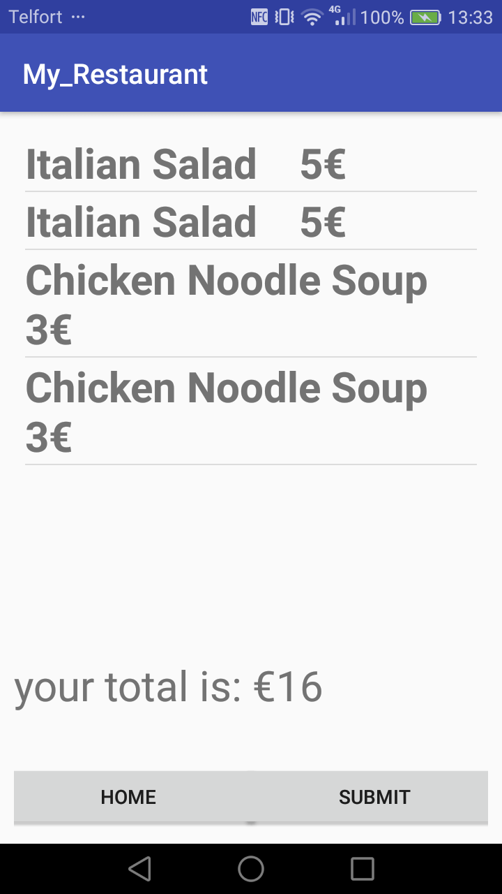

# RestaurantMilanScholten-master
Final push. Layout issues are fixed. Menu has been replaced with two buttons because of performance issues. Up to date with read me.

Sixth assignment of the course App Studio of the minor Programmeren at the Uva.
Let's the user order appetizers and entrees in a restaurant

